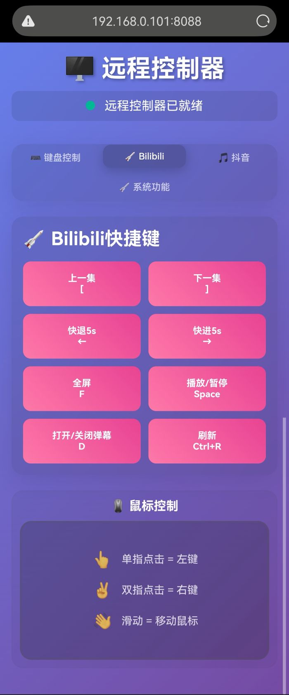

# 远程控制器 (Remote Controller)

[](https://python.org)
[](https://flask.palletsprojects.com/)
[](LICENSE)

一个基于 Python Flask 的现代化远程控制应用，通过 Web 界面实现对计算机键盘、鼠标和触摸板的远程控制。采用模块化架构设计，支持多种输入设备和操作模式。


## 🚀 项目概述

### 项目目的
远程控制器旨在为用户提供一个安全、便捷的方式，通过移动设备或其他计算机的浏览器远程控制目标计算机。特别适用于：
- 无线鼠标键盘替代方案
- 床上控制电脑播放视频

### 核心特性
- ⌨️ **智能键盘输入**: 文本输入、快捷键、特殊按键组合
- 📱 **触摸板模拟**: 支持单指移动、双指滚动、双指右键等手势
- 🎯 **精确控制**: 高精度坐标定位和平滑移动
- 🔧 **系统集成**: 深度集成 Windows 系统功能
- 🌐 **跨平台访问**: 支持任何现代浏览器设备
- 🛡️ **安全设计**: 本地网络运行，支持访问控制

## 📋 系统要求

### 服务端 (被控制的计算机)
- **操作系统**: Windows 10/11, macOS 10.14+, Linux (Ubuntu 18.04+)
- **Python**: 3.12 或更高版本
- **内存**: 最少 256MB 可用内存
- **网络**: 支持 TCP/IP 网络连接

### 客户端 (控制设备)
- **浏览器**: Chrome 90+, Firefox 88+, Safari 14+, Edge 90+
- **网络**: 与服务端在同一网络或可访问网络
- **设备**: 支持触摸的移动设备或带鼠标的计算机

### 页面截图


## 🛠️ 安装和设置

### 方法一：使用 uv (推荐)

1. **安装 uv 包管理器**
   ```bash
   # Windows (PowerShell)
   powershell -c "irm https://astral.sh/uv/install.ps1 | iex"
   
   # macOS/Linux
   curl -LsSf https://astral.sh/uv/install.sh | sh
   ```

2. **克隆项目**
   ```bash
   git clone https://github.com/isongxw/remote_controller.git
   cd remote-controller
   ```

3. **安装依赖**
   ```bash
   uv sync
   ```

4. **启动服务器**
   ```bash
   uv run python src/server.py
   ```

### 方法二：使用传统 pip

1. **克隆项目**
   ```bash
   git clone https://github.com/isongxw/remote_controller.git
   cd remote-controller
   ```

2. **创建虚拟环境**
   ```bash
   python -m venv venv
   
   # Windows
   venv\Scripts\activate
   
   # macOS/Linux
   source venv/bin/activate
   ```

3. **安装依赖**
   ```bash
   pip install flask flask-cors pynput
   ```

4. **启动服务器**
   ```bash
   python src/server.py
   ```

### 依赖项说明
- **Flask** (3.1+): Web 框架，提供 HTTP 服务和 API 接口
- **Flask-CORS** (6.0+): 跨域资源共享支持
- **pynput** (1.8+): 系统输入设备控制库

## 📖 使用指南

### 基本使用流程

1. **启动服务器**
   ```bash
   uv run python src/server.py
   ```
   
2. **获取访问地址**
   服务器启动后会显示访问地址：
   ```
   远程控制器服务器启动中...
   访问地址: http://0.0.0.0:8088
   控制页面: http://0.0.0.0:8088/
   ```

3. **连接控制设备**
   - 确保控制设备与服务器在同一网络
   - 在浏览器中访问 `http://[服务器IP]:8088`
   - 开始远程控制


### Web 界面功能

#### 触摸板区域
- **单指移动**: 控制鼠标光标移动
- **单指轻触**: 执行左键点击
- **双指滚动**: 页面或内容滚动
- **双指轻触**: 执行右键点击
- **三指拖动**: 选中窗口移动

#### 控制按钮
- **鼠标按钮**: 左键、右键、中键、双击
- **方向键**: 上、下、左、右导航
- **功能键**: Esc、Tab、Enter、Backspace、Delete
- **修饰键**: Ctrl、Alt、Shift、Win

#### 快捷键面板
- **键盘控制**: Esc、Tab、Enter、Backspace、Delete
- **Bilibili快捷键**: 上一集、下一集、快退、快进、全屏、播放/暂停、打开/关闭弹幕、刷新
- **抖音快捷键**: 上一条、下一条、快退、快进、暂停、网页全屏、全屏、音量+、音量-、打开/关闭弹幕
- **系统功能**: 锁屏、桌面、重启、关机、切换窗口

## 🏗️ 代码结构

```
remote_controller/
├── src/                          # 源代码目录
│   ├── server.py                   # 应用程序入口点
│   ├── core/                     # 核心模块
│   │   ├── __init__.py
│   │   ├── app.py                # Flask 应用工厂
│   │   └── config.py             # 应用配置
│   ├── handlers/                 # HTTP 请求处理器
│   │   ├── __init__.py
│   │   ├── main.py               # 主页面路由
│   │   ├── keyboard.py           # 键盘控制 API
│   │   ├── touchpad.py           # 触摸板控制 API
│   │   └── system.py             # 系统功能 API
│   ├── services/                 # 业务逻辑服务
│   │   ├── __init__.py
│   │   ├── keyboard_service.py   # 键盘操作服务
│   │   ├── touchpad_service.py   # 触摸板处理服务
│   │   └── system_service.py     # 系统功能服务
│   ├── utils/                    # 工具模块
│   │   ├── __init__.py
│   │   ├── security.py           # 安全和权限控制
│   │   └── system_utils.py       # 系统工具函数
│   └── templates/                # Web 模板
│       └── index.html            # 主控制界面
├── .gitignore                    # Git 忽略文件
├── .python-version               # Python 版本指定
├── pyproject.toml                # 项目配置和依赖
├── uv.lock                       # 依赖锁定文件
└── README.md                     # 项目文档
```

### 架构说明

#### 分层架构
1. **表示层** (`handlers/`): 处理 HTTP 请求和响应
2. **业务层** (`services/`): 实现核心业务逻辑
3. **工具层** (`utils/`): 提供通用工具和安全控制
4. **配置层** (`core/`): 应用配置和初始化

#### 核心组件

**KeyboardService**: 键盘输入核心服务  
- 文本输入和特殊按键
- 快捷键组合处理
- 修饰键状态管理

**TouchpadService**: 触摸板手势处理
- 触摸事件识别和处理
- 手势模式检测 (移动/滚动/点击)
- 多点触控支持

## 🔒 安全注意事项

### 重要警告
⚠️ **此应用程序具有完全的系统控制权限，请谨慎使用！**

### 安全建议
1. **网络安全**
   - 仅在受信任的本地网络中使用
   - 避免将服务暴露到公共互联网
   - 考虑使用防火墙限制访问

2. **访问控制**
   - 使用完毕后立即关闭服务器
   - 定期检查网络连接状态
   - 监控异常访问活动

3. **系统安全**
   - 确保运行环境的安全性
   - 定期更新依赖包版本
   - 避免在生产环境中使用调试模式

---

**感谢使用远程控制器！** 如果这个项目对您有帮助，请考虑给我们一个 ⭐ Star！